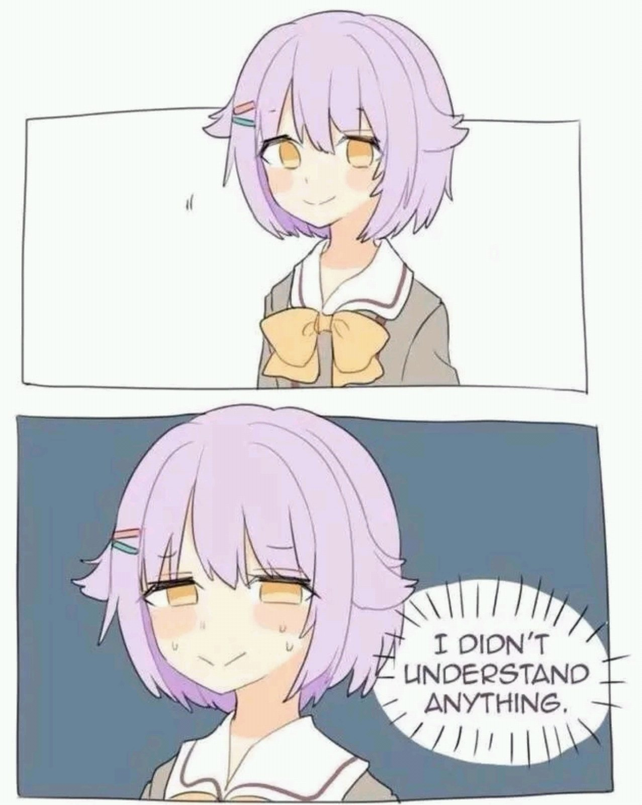
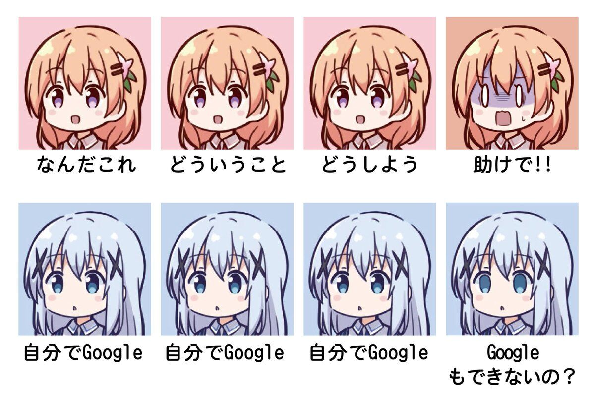

# CS:APP！ 从入门到\_\_\_\_\_

### Overview

+ `/exam/`
  + 往年考题
+ `/lesson/`
  + 往年课件
+ `/homework/`
  - 往年作业
  - `CSAPP1e-solution-manual`
    - CSAPP Edition 1 官方manual
    - 虽说是官方，其中也有不少错解
  - `CSAPP-solution-Vincent-Lee`
    - CSAPP solution by me
    - 前半部分为 CSAPP Edition 2 solution，后半部分为CSAPP Edition 3 solution
      - 由于2016年CSAPP Edition 3印刷较迟。2016年前半学期采用CSAPP Edition 2教学，后半学期采用CSAPP Edition 3
    - 有疑问请联系 ihalbmond@gmail.com
+ `/labs/ `
  + 因为沉迷刷榜，当时有一半的lab刷到了rank 1
  + ~~代码十分混乱，以后回来填坑整理~~
+ `/notes/`
  + 笔记
+ `/audio-lectures/`
  + 2016年下半学期课堂录音，配合课件食用。感谢森聚分享！

### FAQ

Q: How to read my textbook？

A: In a nutshell,  Skim the book first, then pursue deeper comprehension.

Q: 如何阅读书本？

A: 相比书本，确保理解课件的所有细节更加重要。一言以蔽之，首先粗略地浏览全书，再一遍遍加深阅读深度。中文版的确存在不少令人胃疼的翻译，如c语言中的 'switch' 被翻译成 ''开关''。建议配合英文书本/课件食用。

Q: 北大的ICS课程有必要投点吗？

A: 不需要。正课：完全可以选其中一位教授的课，实则去另一个教室听课；讨论班：学生随机分配到小班，不需要投点。

Q: How to log into the *server*?

A: connect through *SSH*: `linux> ssh –p xx22 student-id@ics9.pku.edu.cn`

Q: 如何登录服务器？

A: 用SSH连接: `linux> ssh –p xx22 student-id@ics9.pku.edu.cn`

### Making use of Official Resources

#### CMU course site

+ [Schedule](https://www.cs.cmu.edu/~213/schedule.html)
  + cmu课件/视频下载

+ [Exams](https://www.cs.cmu.edu/~213/exams.html)
  + cmu往年试题，难度低于pku

#### Text Book

+ [Student Site](http://csapp.cs.cmu.edu/3e/students.html)
  + GDB Materials
    + Beej's [Quick Guide to GDB](http://beej.us/guide/bggdb/)
    + Two-page x86-64 GDB cheat sheet ([pdf](http://csapp.cs.cmu.edu/3e/docs/gdbnotes-x86-64.pdf), [txt](http://csapp.cs.cmu.edu/3e/docs/gdbnotes-x86-64.txt))
      +  cheat sheet包含了所有本课程所需的gdb命令
  + [Unix FAQ](http://csapp.cs.cmu.edu/3e/unixfaq.html)
    + unix 命令/ 系统调用 / c标准库 相关的疑问建议多多使用 google，很容易找到清晰全面的资料
  + [Code examples](http://csapp.cs.cmu.edu/3e/code.html)
    + quite useful resource for lab
    + code examples 在肝 lab 的时候十分有用，尤其是后面的几个 lab
  + [Labs for self-study students (without solutions)](http://csapp.cs.cmu.edu/3e/labs.html)
    + 提前完成cmu的lab，不过上面的lab和pku的lab要求有一定出入，不过大体知识点相同
      + pku 的 lab 以 x86-64 架构为主
      + [*Attack Lab*](http://csapp.cs.cmu.edu/im/labs/attacklab.tar) 与 [*Buffer Lab (IA32)*](http://csapp.cs.cmu.edu/im/labs/buflab32.tar)内容基本相同，pku 采用的是 x86-64的Attack Lab
      + [*Performance Lab*](http://csapp.cs.cmu.edu/im/labs/perflab.tar) 已被 [*Cache Lab*](http://csapp.cs.cmu.edu/im/labs/cachelab.tar)替代
    + autolab上的ranking首要依据是score，其次是完成lab的日期

+ [Web Aside](http://csapp.cs.cmu.edu/3e/waside.html)
  + 书中的web aside 也可以在CS:APP官网上找到

### Some unofficial Resources

+ All in all, 最重要的当然是善用Google啦！

  

+ http://wdxtub.com/2016/04/16/thin-csapp-0/

+ http://wdxtub.com/2016/04/16/thick-csapp-lab-0/

